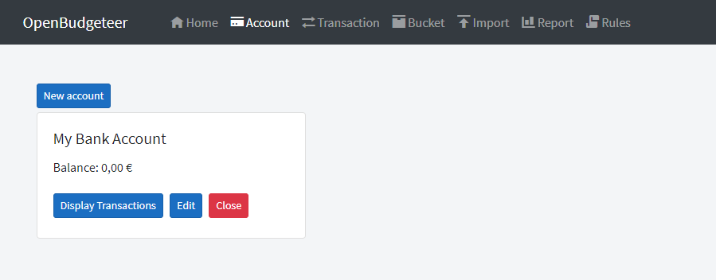
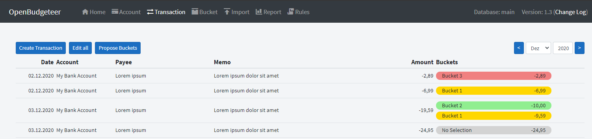

# How to use

## Bucket budgeting in OpenBudgeteer explained

There are several ways how to do finance planning, one of them is the so called "bucket budgeting".

In the old-fashioned way you usually only categorize your bank transactions to get a historical overview on how much money you have spent in the past. Bucket budgeting goes the other way around and tries to set expectations on how much money you will spend on certain categories, so that you know how much budget is needed and how much you can spend.

### What is a bucket?

A bucket can be seen as kind of a category. Its naming defines for what kind of expense the money will be spent in future, optionally it can have a due date in case you know when the expense will happen. Another use case for a bucket can be a deposit for long-term savings. Overall you can put money into buckets and later on take it out to finance the respecitve expense or to move it to another bucket.

Putting money in and out from buckets happens in OpenBudgeteer in an automated way, but can be also done manually. This will be explained over the next sections.

### Bucket types in OpenBudgeteer

Currently OpenBudgeteer defines 4 types of buckets:

#### Standard Bucket

This is the default type in OpenBudgeteer and just a plain bucket without any specfic requirements or configruations.

#### Monthly expense

Typically you have expenses that you have to pay on a monthly basis where you also know the exact amount like rent, insurance costs or liquidation of loans. For such use cases the bucket type "Monthly expense" can be used. For every month it wants to have the configured target amount and based on this "Want" you put money into it. Once you assign a bank transaction to this bucket, the money will be taken out again and typically the balance is 0. For the next month the same procedure starts again.

But there can be some cases where you just don't know how much money you will spend in this month like for groceries, car costs, free time costs etc. Here you make an estimate on how much money will be required for every month with a fixed value. If this estimate variates you rather want to use the **Standard Bucket**. At the end of the month the balance should be positve or at least 0, if it is negative consider moving money from anthoer bucket into this one.

#### Expense every X months

All in all this bucket type is equal to **Monthly expense** with the difference that the expense will not happen every month. Usually this type is used for expenses that occur on a yearly or quarterly base, but of course you can set your own occurance.

Creating such a bucket requires input on the target amount, the number of months (that's the X) and the first target date where the expense is expected.

Based on these details and its balance OpenBudgeteer will calculate how much money you should put into this bucket for the current month. The required amount will be distributed over the whole timeline which means every month you put small amounts into this bucket and in the final month you have enough savings to finance the expense. The progress will be visualized with a progress bar in OpenBudgeteer.

After that the next interation starts and for every month the expected amount will be calculated again. There is no need to update the target date in the config for this bucket (as said it's only for the first target date).

#### Save X until Y date

This bucket type you use if you want to save a fixed amount of money every month until a specific target date.

## Get started

### Create bank account

The best way to start with OpenBudgeteer is to create at least one bank account on the `Account Page`. There is not much to configure here, just enter a name and that's it.

### Create buckets

With creating your buckets you immediately make your finance planning. Think about what kind of expenses you have, how you could group them and how they occur.

On the first level you create a bucket group which is just a clustering of similar buckets. There is no specfic logic behind that, it's just for visual purposes.

Once you have some Transactions imported you can start creating Buckets on the `Bucket Page`. If you don't know what kind of Buckets you need, maybe start with some Buckets for your monthly or even yearly expenses like Car Insurance, Property Taxes, Instalments etc. and Buckets for your regular needs like Groceries or Gas. You can also create a Bucket for your next big trip by putting some money into it every month.

If you are happy with your setup, put some money into your Buckets. You can do it manually or automatically if a Bucket has a Want for the current month.

### Import Transactions

After that export some Transactions from your Online Banking and import the data using `Import Page`. At the moment it support CSV files only but you can individually set the characters for delimiter and text qualifier. The respective settings and other options are shown once the CSV file has been uploaded.

You also need to create an initial Transaction which includes the Bank Balance on a certain date. It should be the previous day of the very first imported Transaction. You can do this on the `Transaction Page`.

Example:

You have imported all Transactions starting 2020-01-01. To have the right Balances create a Transaction for 2019-12-31 and add as amount the Account Balance of this day. You can mark this Transaction as `Income` (see more explanation in section `Bucket Assignment`).

### Bucket Assignment

In the final step you assign your Transactions to certain Buckets. Go back to the `Transaction Page`, edit a Transaction and select an appropriate Bucket. You can also do a mass edit. If a Transaction belongs to more than one Bucket just reduce the assigned amount and you get automatically the option to assign the remaining amount to another Bucket.

Transactions which represent your (monthly) income can be assigned to the pre-defined `Income` Bucket. If you have transferred money from one Account to another you can use the `Transfer` Bucket. Please ensure that all `Transfer` Transaction have in total a 0 Balance to prevent data inconsistency and wrong calculations.

Once all Transactions are assigned properly you can go back to the Bucket Overview to see if your Budget management is still fine or if you need to do some movements. You should always ensure that your Buckets don't have a negative Balance. Also your `Remaining Budget` should never be negative.

### Bucket History

OpenBudgeteer has a built-in versioning for Buckets which enables a proper history view on previous months. If you modify a Bucket, like changing the Type or the Target Amount, it will create a new version for the current selected month. It is not recommended to change a Bucket in the past, a change between two Bucket Version is prevented.

If you close a Bucket it will be marked as `Inactive` for the next month. This can be only done if the Bucket Balance is 0 to prevent wrong calculations.

