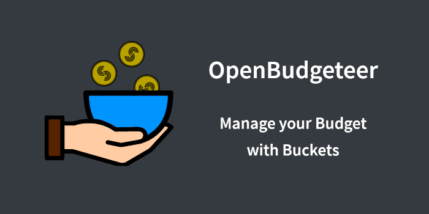

# Home

    

    
    

    
    
    

OpenBudgeteer is a budgeting app based on the Bucket Budgeting Principle and inspired by [YNAB](https://www.youneedabudget.com) and [Buckets](https://www.budgetwithbuckets.com). The Core is based on .NET and the MVVM Pattern, the Front End uses Blazor Server.
